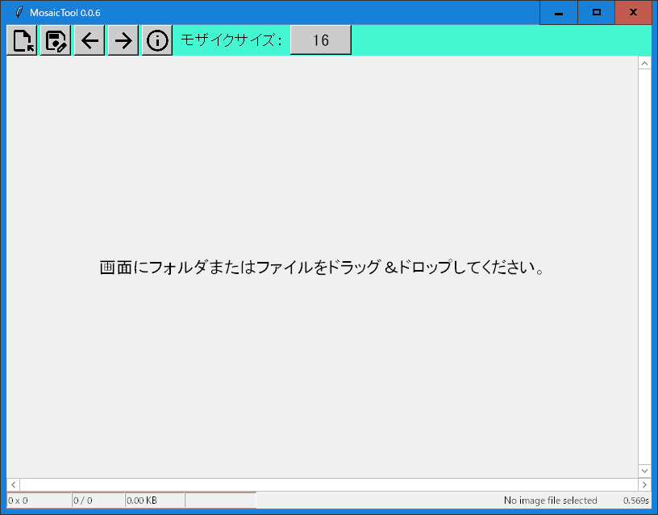

# 🌟 MosaicTool — モザイク編集のお供に
  

`MosaicTool`は、手軽にモザイク加工ができるパソコン用アプリです。直感的な操作とストレスフリーを追求し、誰でも簡単にモザイク画像を作成できます。  
  

## 🎉 主な特長  
- 簡単操作：マウスで範囲を選択するだけで、瞬時にモザイク加工が適用されます。  
- 高速処理：わずかな時間でモザイク加工を完了。ストレスなく作業が進みます。  
- 安全なファイル管理：元のファイルはそのままに、加工後の画像は別名で保存されます。  
## 🔒 セキュリティの利点: 信頼性とプライバシー保護  
`MosaicTool`はオープンソースであり、アプリのコードが公開されているため、ユーザーは自分自身で実行ファイルを生成し、ローカルで確認することができます。  
これにより、信頼性の高い実行ファイルを生成し、セキュリティ上の懸念を軽減することができます。  

また、ネットワークにデータを送信せずにローカルで完結するため、ユーザーのプライバシーも保護されます。  

### 自分自身で実行ファイルを生成する  
こちらのページを参考にしてください。 [docs/README.md](docs/README.md)  

## 🚀 導入方法  
### 1. セットアップ  
1. [Releases](https://github.com/umyuu/MosaicTool/releases)ページを開き、一番上の Assets 欄にある `MosaicTool.zip` をダウンロードします。  
1. zipファイルを展開します。  
### 2. 実行  
展開されたフォルダ内の `MosaicTool.exe` ファイルをダブルクリックするだけ。さらに、画像ファイルをドラッグ＆ドロップするだけで簡単にモザイク加工を開始できます。  

### ✨ モザイク加工の方法  
1. 画像を開く  
1. マウスで範囲を選択  
1. 選択範囲にモザイクが自動適用  
1. モザイク加工後のファイルが自動で別名保存されます。  

### 📂 モザイク加工ファイルの命名規則  
加工後のファイルは元のファイル名に_mosaic_数字が追加された名前で保存されます。例：original.jpg → original_mosaic_1.jpg  

自動上書き保存  
元のファイルと同じ幅・高さのモザイク加工ファイルが既に存在する場合、新しい加工ファイルは自動的に上書き保存されます。  

## 🔧 開発者向け情報  
### 📜 ソースコードライセンス  
[MIT License](LICENSE)  
実行ファイルに含まれるアイコンについては、[ThirdPartyNotices.txt](ThirdPartyNotices.txt) をご参照ください。  
